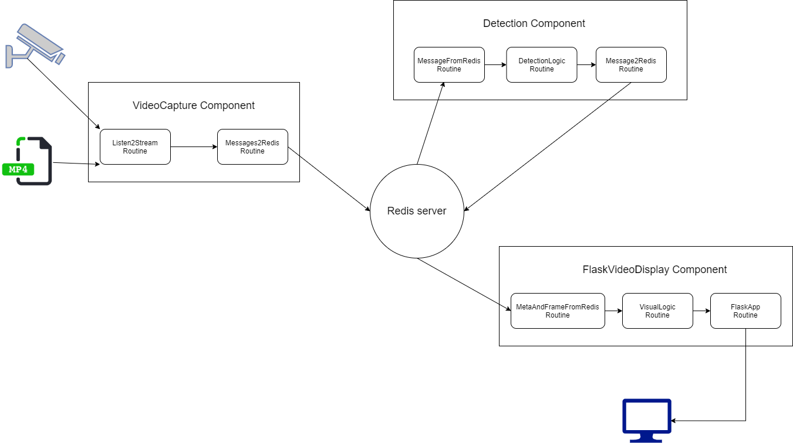

# PipeRT Documentation



High level diagram of the pipeline


## Component

Each component has a zerorpc server and a list of routines.
The zerorpc server exposes all of the component's functions, allowing other components/processes (both local and remote ones) 
to call them.
For example, the video display component has a function called "flip_im" which flips the video.
So any remote (or local) process can connect to the component's zerorpc server and make a call to the "flip_im" function
in order to flip the video. 
See [zerorpc.io](https://www.zerorpc.io/) for more intuitive examples. 

## Routine

A routine is responsible for performing one of the component’s main tasks. 
It can be run either as a thread or as a process. First it runs a setup function, then it runs its main logic function in a 
continuous loop (until it is told to terminate), and finally it runs a cleanup function. 
The routines of a component use queues in order to pass the data between them.

Routines can also register events (and event handlers) which can be triggered at any point. 
By default, each routine registers 2 events which are triggered at the beginning and at the end of each iteration of the 
routine’s main logic loop. Each routine can implement its own handlers for the events. 

## Communication Between Components

The components transfer data to each other using their routines. 
The data flows from one component’s “output routine” to another component’s “input routine” through a redis server. 
The current default approach is to host all of the components on one machine in order to minimize latency within the 
pipeline. The reason is that it allows the frame data to be quickly transferred between components by having them store 
it in their shared memory, and then passing its address to the redis server. 

### Core Technologies
* Python
* OpenCV
* Redis
* PyTorch

## List of Components

1. VideoCapture: powered by openCV’s VideoCapture function. Can accept a stream or a video file. 
2. Detection Components
   1. YoloV3: an object detection component, powered by the YoloV3 algorithm.
   2. FaceDetComponent: an incomplete face detection component. Currently works like an object detector. 
      Powered by openCV’s CascadeClassifier function. 
   3. SORTComponent: an object tracking component, powered by the SORT algorithm. 
   4. Canny: an edge detection component powered by SciPy.
3. Display Components
   1. FlaskVideoDisplay: powered by Flask. Serves the video frames in a local web app using a generator.
   2. CV2VideoDisplay: powered by openCV’s imshow function. Displays the video on a new window. 
      *This component is currently incomplete as it can’t show the results of the detection components.*

## Adding Detection Components

In order to add a new detection component to the pipeline you need to create a new class that inherits from BaseComponent, 
and at least one new routine (which inherits from the Routine class). The new routine would be responsible for performing 
the detection on top of the frames that it receives from an “input routine” and then sending it to the “output routine”. 
The input and output routines already exist: FramesFromRedis, MetadataFromRedis, Frames2Redis, and Metadata2Redis. 

*Currently, none of the detection components work because of some unfinished refactoring. After this will be taken care of, 
it will be fairly easy to use one of the existing detection components as a template for adding a new one.*

## Running the Pipeline

Currently it’s easiest to run the pipeline through a bash script. See [demo_run](demo_run) for a good example. 
There are 3 major commands that need to be executed, one for each component (assuming there are 3 of them).

Running the video capture (there are default values for the options if they aren’t specified):
```
python -m pipert.contrib.vid_capture [OPTIONS] &
```

##### OPTIONS:
```
-i, --infile
	Input file (leave empty to use webcam)
-o, --output
	Output stream key name
-u, --url
	Redis server URL
-w, --webcam
	Webcam device number
-v, --verbose
	Verbose output
--count
	Count of frames to capture
--fmt
	Frame storage format
--fps
	Frames per second (webcam)
--maxlen
	Maximum length of output stream
```
Running the flask display component:
```
python -m pipert.contrib.flask_display [OPTIONS] &
```
##### OPTIONS:
```
-i, --input_im
	Input stream key name
-m, --input_meta
	Input metadata stream key name
-u, --url
	Redis server URL
-z, --zpc
	zerorpc port
--field
	Image field name
```
***When the detection components will work I will update this with instructions on how to run them, 
but it’s the same general idea.***
